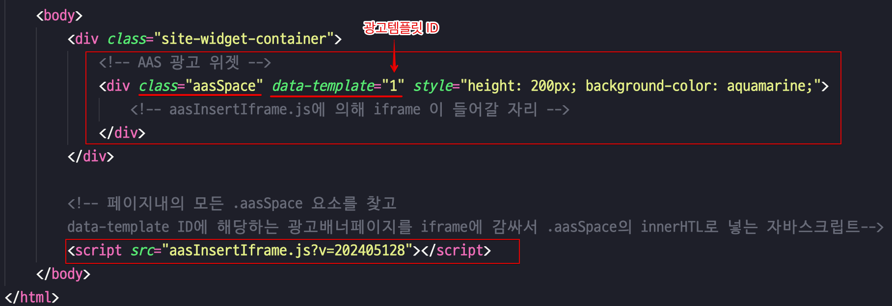

# AAS House - The house of AdAng System
AAS는 javascript 위험요소가 제거된 광고 운용하는 컨셉트의 Advertisement Management 프로젝트입니다. 본 House 레파지토리는 광고를 노출하는 웹사이트 쪽의 PHP 구현코드입니다. 

## ◽ 서버에 설치 

### 서버에 필요한 디렉토리와 파일
`House` 폴더에는 아래의 세 디렉토리가 있습니다. 라이브 서버에는 다음 디렉토리와 그 하위 파일들을 웹 도큐먼트 root에 포함해야 합니다.

* `aas` - 웹에 공개되어야 할 디렉토리
* `aasApiConfig` - private key가 있는 설정파일 포함 (비공개)
* `aasLib` -  PHP 라이브러리 관리 폴더 (비공개)

디렉토리를 변경하거나 다른 경로를 사용하려면 다음위치의 코드를 수정해 사용하십시오. 
* `aasApiConfig/includes/apiCommon.php`에서 DIR에 대한 define() 코드
* `aas/api` 디렉토리 안 php파일들의 `require_once` 경로
* `aasExample/aasInsertIframe.js` 의 `$iframeSrc` 경로

###  ★ 중요! 접근제한 설정 ★
`adsApiConfig`, `adsLib` 디렉토리의 파일은 웹사이트 방문자가 접근할 수 없어야 합니다. 웹서버 설정을 확인하세요.  (참고: 웹서버가 Apache 일 경우 이미 각 디렉토리에 `.htaccess` 파일로 `Deny from all` 설정이 되어있습니다.) 혹은 root가 아닌 다른 접근불가한 디렉토리 하위에 포함한다면 각코드의 DIR 경로를 수정해야합니다.

### config.json 파일생성(API 시크릿 설정)
`adsApiConfig/config.sample.json`파일에 양식이 있습니다. 이 양식대로 같은 폴더에 `config.json` 파일을 별도로 생성해야 합니다. 

`config.json` 파일 내용에 실제 JWT토큰 발급/검증을 위한 secret key와 요청 user/password를 작성해 사용해야합니다.

* `config.sample.json` 양식은 git 추적이 됩니다. 이 파일에 비밀정보를 넣지 마십시오. 
* `config.json`은 `.gitignore`에 명시하여 추적되지 않게 되어있습니다. user/password와 JWT secret key가 외부에 노출되지 않도록 해야합니다.

요청측(광고서버)에는 토큰 발급을 위한 user/password 만 알려주고 sercret_key는 유출 되어선 안됩니다. 

### 서버 디렉토리 권한설정
웹서버 유저 (NginX의 경우 `www-data`)는 `aasApiConfig/temp`, `aas/banners/각템플릿폴더`에 대해 쓰기권한이 설정 되어야 하며, `aas`하위 파일들에 대한 실행권한이 설정되어야 합니다.

### 써드파티 라이브러리 추가 사용 안내
본 프로젝트 패키지는 PHP 써드파티 라이브러리를 사용중입니다:

* `firebase/php-jwt`
* `simplehtmldom/simplehtmldom`

각 라이브러리는 `adsLib/vendor/` composer로 설치, 관리되므로 레파지토리에 포함되어있지 않습니다. 다음 방법으로 필요한 써드파티 라이브러리를 추가 할 수 있습니다.

> #### A) php composer로 설치하려면
>
> 터미널에서 cd 명령어로 `adsLib` 폴더안으로 이동해 아래의 composer 명령어를 입력하세요. 
    > ~~~
    > composer install
    > ~~~
>
> 공유된 프로젝트에 사용된 버전--`composer.json` 파일에 명시된 패키지와 그 버전--그대로 설치됩니다.

> #### B) 직접 설치하려면
> `adsLib/vendor/` 하위에 각 라이브러리 패키지를 추가하십시오. 
> 
> autoload 없이 직접포함하여 사용하려면 `aas/api/token.php`와 `update.php` 의 `require_once` 코드를 다음과 같은 방식으로 추가해야합니다.
    > ~~~
    > require_once '../../path/to/firebase/php-jwt/src/JWT.php';
    > require_once '../../path/to/firebase/php-jwt/src/Key.php';
    > ~~~
> 각 라이브러리 버전넘버는 `composer.json` 파일에서 찾을 수 있습니다.

## ◽ 광고배너 템플릿 예약방식
광고배너의 양식은 사전에 약속된 서식 내에서만 운용됩니다. 여러 템플릿을 두고 `bannerId`로 구분합니다. 요청측은 광고 콘텐트(html)와 스타일(css)을 언제든 바꾸어 요청할 수 있습니다.

`aasApiConfig/templates/` 디렉토리는 광고배너 종류별로 템플릿이 구분되어 저장되어야합니다. 이곳에는 배너별로 html 뼈대와 이 배너페이지에 링크될 js파일을 담아두는 곳입니다. bannerId 별로 구분된 폴더명와 파일명 규칙을 지켜야합니다.

동작방식: `aas/api/update.php`는 템플릿 html 페이지의  `<body>`에 요청받은 html 데이터를, `<head>`에 css 데이터를, 그리고 미리 저장되어있는 js 파일을 추가하여 모든 파일을 `/aas/banners/tempate-X/` 디렉토리에 저장합니다.

모든 광고노출 페이지에 삽입되어야할 `aasInsertIframe.js`은 id에 맞는 `/aas/banners/tempate-X/` 디렉토리의 `index.html`(광고배너 페이지)을  광고로 삽입하게됩니다.

`aasInsertIframe.js` 스크립트는 페이지에 존재하는 모든 `.aasSpace` 태그를 찾아 `data-template="1"`에 쓰여진 숫자에 맞추어 template-ID에 맞는 `광고배너`를 iframe으로 추가합니다.

iframe에 추가될 광고배너는 그 자체가 하나의 웹페이지로써 공개됩니다. `aas/banners` 폴더에 각 배너 템플릿별로 저장됩니다. 이 페이지와 여기에 필요한 css/js 파일은 `/update.php` api에 의해 자동으로 작성됩니다.

## ◽ 광고배너 노출 페이지 설정 (서버 운영측)
광고를 노출할 페이지에 HTML위젯 방식으로 광고를 노출 할 수 있습니다.

### 예제 페이지 파일(php)
`aasExample` 폴더는 광고를 노출하는 페이지에대한 얘시이며 폴더 안에는 다음 두가지 파일이 존재합니다.

* `index.php` -  광고가 노출되는 페이지 php 파일 예시
* `aasInsertIframe.js` - 모든 광고노출 페이지에 추가되어야 할 스크립트입니다.

> 예시 페이지의 동작을 보고 싶다면 `aasExample` 폴더를 사이트의 root에 복사해 넣으면 https://example.com`/aasExample/` 주소로 접속해 확인할 수 있습니다.

  
  
<em>index.php</em>

서버 운영측은 사이트의 위젯 컨테이너(사이드바 등)에 위 그림처럼 `.assSpace` 클래스와 `data-template` 속성을 가진 태그를 광고위젯으로써 추가해야 합니다.

사이트의 main css에서 컨테이너에 대한 높이나 지정하여 사용하거나 `.aasSpace`의 높이를 명시하여 사용하십시오.

### HTML 테스트 페이지
`aasTest` 폴더는 또 다른 예제 페이지입니다. 페이지 레이아웃이 적용된 `index.html` 웹페이지를 담고 있으며 광고노출을 위한 `aasInsertIframe.js` 가 삽입되어있습니다.

웹사이트 도큐먼트 root에 `aasTest` 폴더를 추가하면 https://example.com`/aasTest/`로 접속해 광고 노출을 확인할 수 있습니다. 

## ◽ 요청측(광고서버) API 사용 프로세스

### API Endpoints
다음 두 엔드포인트를 사용할 수 있습니다.
* `/aas/api/token.php` - 토큰 발급 엔드포인트
* `/aas/api/update.php` - 광고배너 업데이트 요청 엔드포인트

> 참고: `/aas/api/getTemplateVersion.php` 도 있으나 이는 광고배너 페이지에대한 `?v=`  캐싱 버전관리용 파라미터를 위해 `aasInsertIframe.js` 파일의 코드에서만 사용되기 위함입니다. 배너페이지의 파일이 수정된 날짜로 버전번호가 바뀝니다.

요청측(광고서버)에서는 사전에 발급받은 user,password를 통해 `/aas/api/token.php`로 JWT 토큰을 받아야합니다. 이 토큰은 유효기간이 있습니다.

House측이 노출중인 광고위젯의 광고배너를 변경하려면 사전에 정해진 광고(HTML/CSS) 템플릿을 JSON과 함께 요청측이 `/aas/api/update.php` 엔드포인트에 요청합니다.

* 1) JWT 퍼블릭 토큰 요청:
    * 요청자는 `/aas/api/token.php` 주소로 user,password 와 함께 POST 요청하면 JWT 토큰을 받을 수 있습니다.  이 토큰은 유효기간이 있습니다.
* 2) 광고배너 업데이트 요청
    * `/aas/api/update.php` 주소로 JWT 토큰과 함께  사전에 정해진 광고(HTML/CSS) 템플릿을 JSON 데이터로 전송하면 House의 노출페이지의 광고배너 변경이 즉시 반영됩니다.
      > JSON 포맷 예시:
      > ~~~
      > {
      >   "bannerId": "banner123",
      >   "html": "
Welcome to our Website!
",
      >   "css": "div { border: 1px solid #000; padding: 10px; }"
      > }
      > ~~~

## ◽ 광고배너 템플릿 제작
House측의 update.php 엔드포인트는 html과 css로는 어떠한 javascript 코드도 받지 않으므로 이에대해선 별도의 js 파일을 로드하는 방식이어야합니다. 

HTML Tag에서 `<script>`, `onClick()`, `onError()` 등은 제외하십시오. 필요하다면 별도의 js파일에서 이벤트로 직접 바인딩하도록 설계해야합니다.

별도의 js 파일은 사전에 House측에 다른방법으로 전달 되어 `aasApiConfig/templates/` 폴더에 배너 템플릿별로 저장 되어야합니다.

### templateDesign 폴더
templateDesign 폴더는 서버에 사용되지 않는 폴더입니다. 광고배너를 디자인하고 테스트하는데 사용하기위한 단순 참고 파일입니다. 

`bannerTemplate-1`의 예시파일이 첨부되어있습니다. html/css/js 파일을 포함하여 배너 템플릿을 디자인하고 출력해보는데 사용하십시오.

`jsonConverter.html` 파일을 실행해서 API 엔드포인트에 요청하기위한 JSON 데이터를 만들 수 있습니다. `jsonConverter.html`을 웹브라우저로 열고
1)  `bannerID`에는 광고배너 템플릿 ID를, 
2) HTML 입력부분에는 `<body>` 에 들어갈 DOM Element를, 
3) CSS 입력칸에는 Style Sheet 전체 내용을 넣고 
4) 마지막으로 `Convert` 버튼을 클릭하면 json raw string이 생성됩니다.

